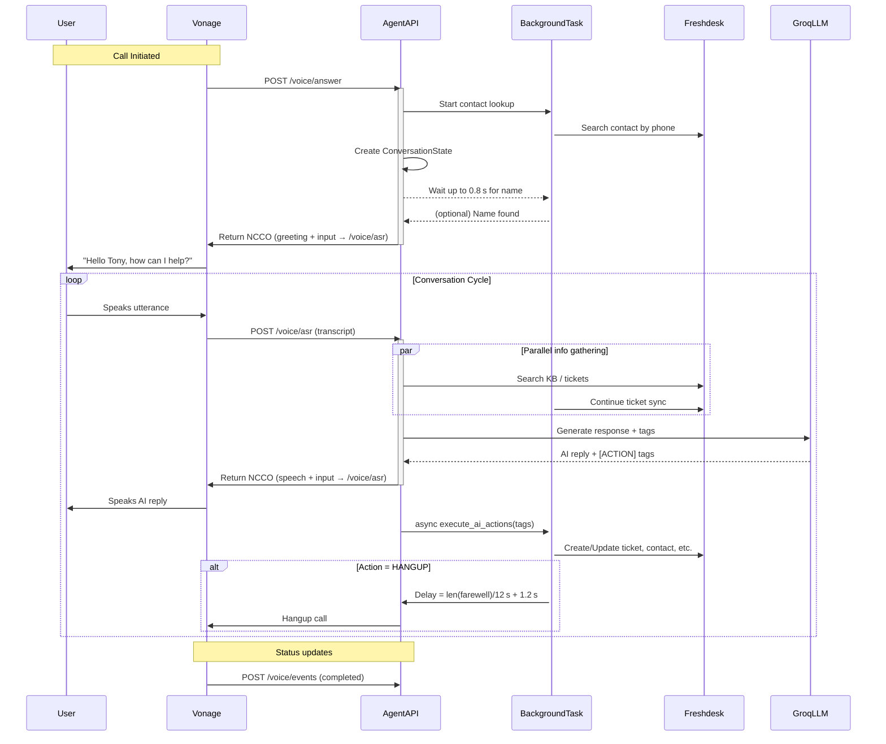

# Voice Agent System Architecture

This document outlines the architecture and call flow for the **Sandeza Voice Agent**.

## 1. System Overview

The voice agent is a **FastAPI** service that orchestrates three external platforms:

| Platform | Role |
| :--- | :--- |
| **Vonage Voice API** | Telephony – inbound/outbound call handling, TTS injection, call control (hang‑up, transfer). |
| **Groq LLM** | Generates conversational replies and emits `[ACTION: …]` tags for backend processing. |
| **Freshdesk** | CRM – contact lookup/creation, ticket creation, updates, sentiment tagging. |

### Core Endpoints

| Endpoint | Method | Purpose | Trigger |
| :--- | :--- | :--- | :--- |
| `/voice/answer` | GET/POST | **Call entry point** – creates a fresh `ConversationState`, starts background contact lookup, returns an NCCO that greets the caller and opens the input channel. | Incoming call |
| `/voice/asr` | POST | **Conversation loop** – receives a transcript from Vonage, builds context, calls Groq, streams the AI reply via TTS, and parses any action tags. | User finishes speaking |
| `/voice/events` | POST | **Monitoring** – logs call‑status changes (ringing, answered, completed) and updates state. | Call status change |

---

## 2. Call Logic Flow

### A. Initialization (`/voice/answer`)
1. **Session Start** – a clean `ConversationState` is stored under the call UUID.
2. **Background Lookup** – extracts the caller’s phone number, asynchronously searches Freshdesk for a contact and recent tickets.
3. **Hybrid Wait** – waits up to **0.8 s** for a name; if found, the greeting is personalized (e.g., `"Hello Tony…"`), otherwise a generic greeting is used.
4. **Response** – returns an NCCO that:
   * Plays the greeting via Vonage TTS.
   * Opens the input channel so the next user utterance is posted to `/voice/asr`.

### B. Conversation Loop (`/voice/asr`)
| Step | Description |
| :--- | :--- |
| **1 Receive Speech** | Vonage posts the transcript to `/voice/asr`. |
| **2 Context Building** | Retrieves conversation history, fetches relevant Freshdesk KB articles, and adds any recent tickets. |
| **3 AI Processing** | Calls `groq.agent_response()` (Groq LLM) with the assembled context. |
| **4 Action Detection** | Parses tags of the form `[ACTION: TYPE[: DATA]]`. Supported actions: `CREATE_TICKET`, `RESOLVE_TICKET`, `UPDATE_NAME`, `TRANSFER`, `HANGUP`. |
| **5 Response** | Strips tags, injects the clean speech via Vonage TTS, and returns an NCCO that re‑opens the input channel for the next turn. |
| **6 Background Execution** | All tags are handed off to `execute_ai_actions()` as an `asyncio` task so the user hears the reply without waiting for CRM calls. |
| **7 Hang‑up Timing** | When `[ACTION: HANGUP]` is processed, a delay based on the length of the farewell (`≈ chars/12 s + 1.2 s` buffer) guarantees the full TTS playback before the call is terminated. |

---

## 3. Visual Flowchart

---

### Key Takeaways
* **Stateless FastAPI** – each call is identified by a UUID; all per‑call data lives in an in‑memory store.
* **Async background tasks** keep the user‑experience snappy: CRM actions, ticket updates, and the final hang‑up happen *after* the TTS finishes.
* **Strict resolution flow** – the LLM must ask “Has this resolved your issue today?” before emitting `RESOLVE_TICKET` and `HANGUP`, preventing premature disconnections.

This architecture provides a responsive, professional voice‑assistant that integrates telephony, AI, and CRM while ensuring the caller always hears a complete farewell before the call ends.
